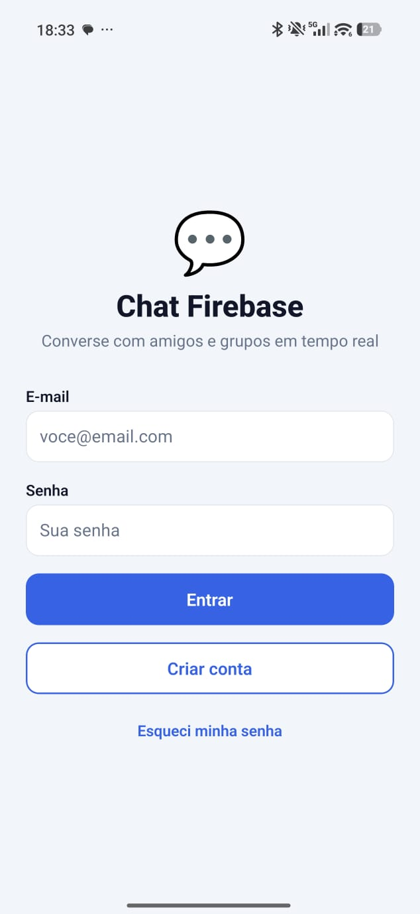
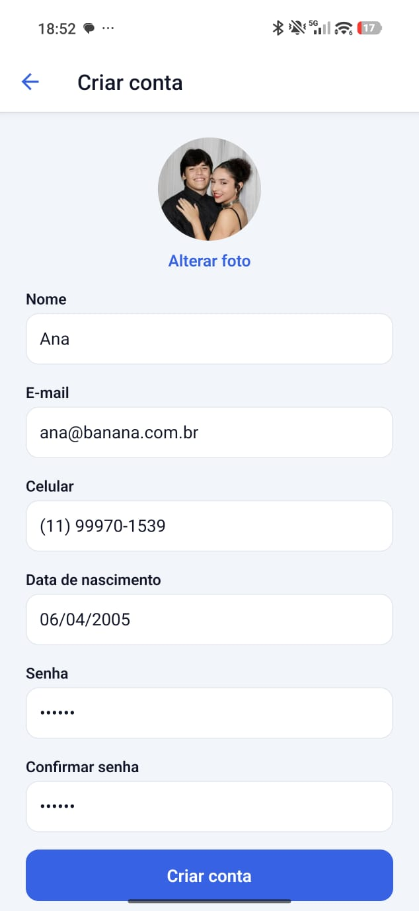
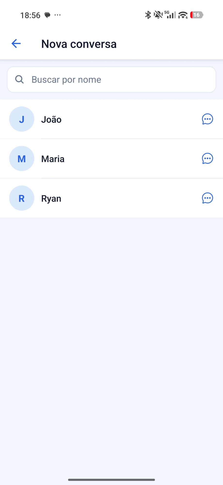
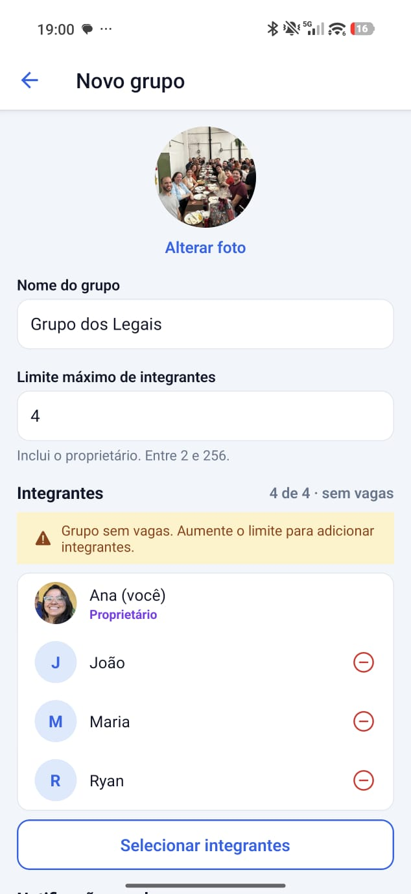
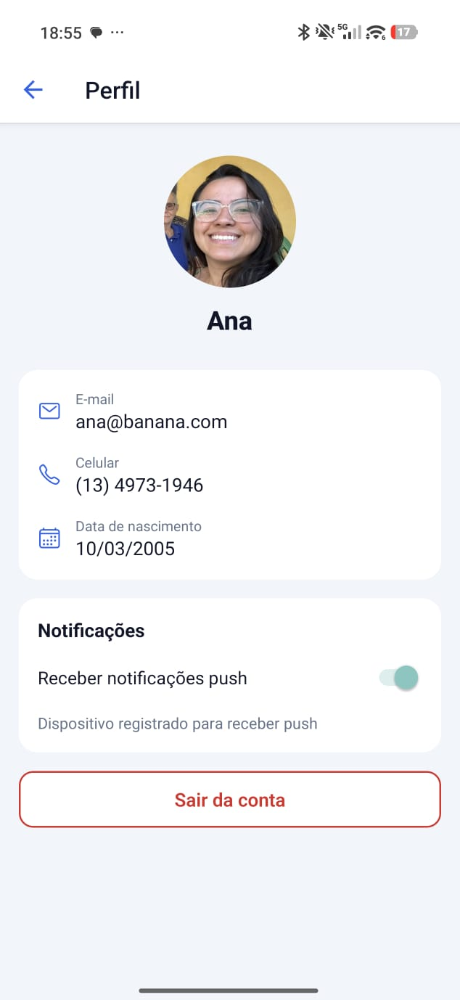
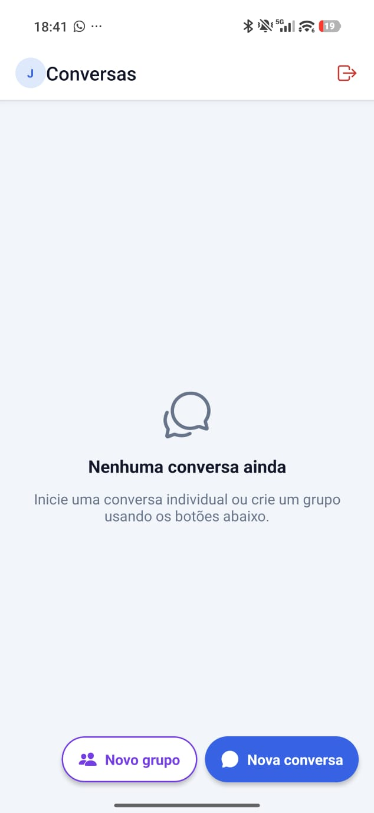
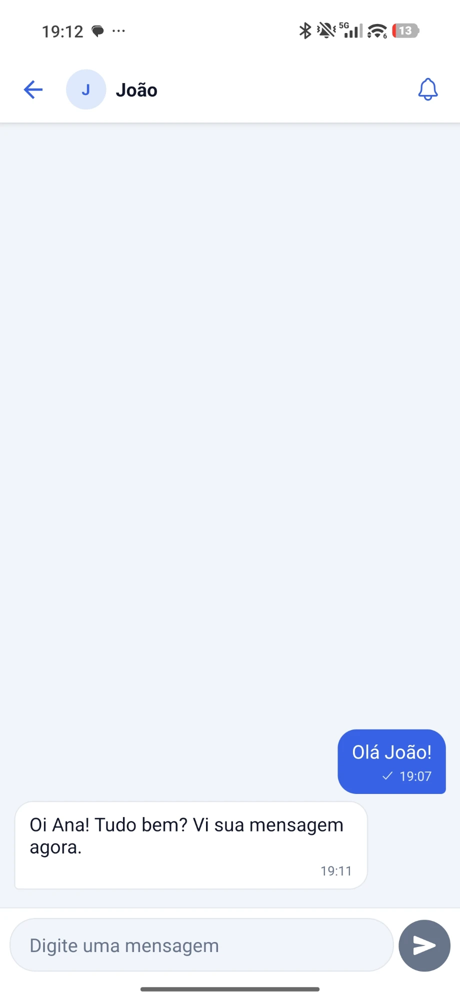
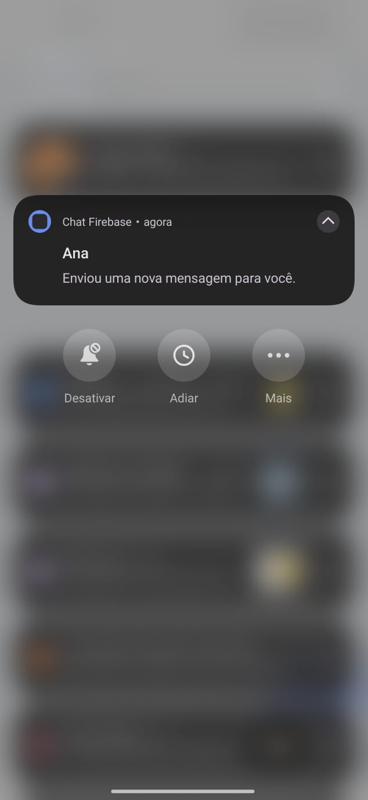

# 💬 Chat Firebase — Conversas individuais e em grupo com Push Notifications

Aplicativo de chat em **React Native + Expo + TypeScript** com conversas individuais e em grupo, mensagens em tempo real e notificações push. O backend usa **Firebase** (Authentication, Realtime Database, Cloud Firestore e Cloud Messaging, todos no plano gratuito Spark), **Cloudinary** para as fotos e uma **API própria em Node.js/Express**, publicada na internet, que envia as notificações e assina os uploads com segurança.

## Integrantes

- RM554510 — Arthur Cotrick Pagani
- RM558487 — Diogo Leles Franciulli
- RM559085 — Felipe Sousa de Oliveira
- RM554497 — Ryan Brito Pereira Ramos
- RM557067 — Vitor Chaves

---

## 📋 Sumário

1. [Tecnologias](#-tecnologias)
2. [Serviços Firebase e responsabilidades](#-serviços-firebase-e-responsabilidades)
3. [Arquitetura e fluxo de uma mensagem](#-arquitetura-e-fluxo-de-uma-mensagem)
4. [Estrutura do projeto](#-estrutura-do-projeto)
5. [Tipagem, hooks e imutabilidade](#-tipagem-hooks-e-imutabilidade)
6. [Configuração do Firebase](#-configuração-do-firebase)
7. [Armazenamento de fotos](#-armazenamento-de-fotos)
8. [Instalação e execução do app](#-instalação-e-execução-do-app)
9. [Notificações no Android e iOS](#-notificações-no-android-e-ios)
10. [API de notificações](#-api-de-notificações)
11. [Política de notificações](#-política-de-notificações)
12. [Limite de integrantes e concorrência](#-limite-de-integrantes-e-concorrência)
13. [Regras de segurança](#-regras-de-segurança)
14. [Estados tratados na interface](#-estados-tratados-na-interface)
15. [Telas](#-telas)
16. [Evidência de notificação](#-evidência-de-notificação)
17. [Checklist de requisitos](#-checklist-de-requisitos)

---

## 🧰 Tecnologias

| Camada | Tecnologia |
|---|---|
| App | React Native 0.86, **Expo SDK 57** (`expo ~57.0.25`), React 19.2, TypeScript (strict, sem `any`) |
| Navegação | React Navigation 7 (native stack, parâmetros tipados) |
| Autenticação | Firebase Authentication (somente e-mail e senha) |
| Mensagens | Firebase Realtime Database |
| Perfis, grupos, tokens e preferências | Cloud Firestore |
| Fotos | Cloudinary (upload assinado pela API) |
| Push | Firebase Cloud Messaging (Android) e Expo Push Service/APNs (iOS), via `expo-notifications` |
| API | Node.js 22 + Express 5 + Firebase Admin SDK, hospedada no Render (HTTPS) |
| Testes da API | `node:test` executado com `tsx` |

Versão do Expo: **SDK 57**. O push remoto não funciona no Expo Go, por isso o app usa **development build** (`expo-dev-client`).

---

## 🔥 Serviços Firebase e responsabilidades

| Serviço | Uso no projeto |
|---|---|
| **Authentication** | Cadastro e login por e-mail/senha, persistência da sessão com AsyncStorage (recuperação ao reabrir o app), identificação por `uid`, redefinição de senha e logout. |
| **Realtime Database** | `messages/{conversationId}/{messageId}` (todas as mensagens individuais e de grupo), `lastMessages/{conversationId}` (prévia da lista de conversas) e `conversationMembers/{groupId}/{uid}` (espelho dos integrantes, escrito **somente pela API**, usado pelas regras). Listeners em tempo real com remoção ao desmontar a tela. |
| **Cloud Firestore** | `users/{uid}` (dados cadastrais), `publicProfiles/{uid}` (nome e foto para busca), `users/{uid}/devices/{deviceId}` (tokens de push, privados), `users/{uid}/preferences/notifications` (preferências), `groups/{groupId}` (metadados, integrantes, `memberLimit`, `notificationPolicy`), `directConversations/{id}` e `notificationDispatches/{id}` (idempotência, apenas API). |
| **Cloud Messaging** | Entrega das notificações no Android (app em primeiro plano, segundo plano ou fechado) com `conversationId` e `conversationType` no payload. |

### Estrutura de dados

```text
Firestore
├── users/{uid}                         name, email, phoneNumber, birthDate, photoUrl, createdAt
│   ├── devices/{deviceId}              token, provider (fcm|expo), platform, enabled, updatedAt
│   └── preferences/notifications       pushEnabled, mutedConversationIds, updatedAt
├── publicProfiles/{uid}                name, nameLower, photoUrl, updatedAt
├── groups/{groupId}                    name, photoUrl, ownerId, memberIds, memberLimit,
│                                       notificationPolicy, createdAt, updatedAt
├── directConversations/{uidA_uidB}     participantIds, createdAt
└── notificationDispatches/{cid__mid}   status, recipients, delivered, failed (somente API)

Realtime Database
├── messages/{conversationId}/{messageId}
│     conversationId, conversationType, senderId, text, target, mentionedUserIds, createdAt
├── lastMessages/{conversationId}       messageId, senderId, text (prévia), createdAt
└── conversationMembers/{groupId}/{uid}: true   (somente a API escreve)
```

- O ID da conversa individual é formado pelos dois `uid` **ordenados** (`uidA_uidB`), garantindo uma única conversa por par. Grupos usam o ID automático do Firestore (sem `_`).
- `createdAt` das mensagens usa o horário do servidor (`serverTimestamp()`), validado pela regra `newData.val() === now`.

---

## 🧭 Arquitetura e fluxo de uma mensagem

```text
Usuário envia a mensagem
        ↓
App grava messages/{cid}/{mid} + lastMessages/{cid} (escrita atômica multi-path no RTDB)
        ↓
Listeners (onValue) atualizam a conversa aberta e a lista de conversas
        ↓
App chama POST /notifications/messages { conversationId, messageId } com o Firebase ID Token
        ↓
API valida o token (Admin SDK) → confirma no RTDB que a mensagem existe e o senderId é o usuário
        ↓
API lê no Firestore participantes, política, preferências e tokens → calcula os destinatários
        ↓
FCM (Android) / Expo Push (iOS) notificam somente os destinatários permitidos
```

- O app **nunca** envia lista de destinatários e **não** possui credenciais administrativas.
- Se o push falhar, a mensagem continua salva e o app exibe um aviso não bloqueante.
- Ao tocar na notificação, o app lê `conversationId`/`conversationType` do payload e abre a conversa (inclusive com o app fechado).

**Decisão de projeto — validações entre bancos:** as regras do Realtime Database não conseguem ler o Firestore. Por isso a API é responsável pelas validações que dependem dos dois serviços: ela espelha os integrantes de cada grupo (Firestore → `conversationMembers` no RTDB) sempre que o grupo é criado/alterado e a cada push, confirma remetente e participação antes de notificar, e controla o acesso aos dados cadastrais de integrantes de grupos.

---

## 🗂️ Estrutura do projeto

```text
.
├── App / Expo
│   ├── app.config.ts                 # Configuração do Expo (plugins, permissões, google-services)
│   ├── firebaseConfig.json           # Configuração do SDK cliente (sem segredos)
│   ├── .env.example                  # Variáveis do app (URL da API, projectId EAS)
│   ├── eas.json                      # Perfis de build (development, preview, production)
│   └── src/
│       ├── App.tsx
│       ├── components/               # Avatar, ChatMessage, ChatInput, ConversationItem,
│       │                             # GroupMemberItem, Loading, ErrorMessage, PolicySelector...
│       ├── screens/                  # Login, Register, Conversations, Users, GroupForm,
│       │                             # Chat, Profile, GroupMembers
│       ├── services/                 # firebase, authService, userService, groupService,
│       │                             # chatService, notificationService, storageService, apiClient
│       ├── hooks/                    # useAuth, useChat, useGroups, useConversations,
│       │                             # useNotifications, useUsers, useProfile, usePreferences...
│       ├── contexts/                 # AuthContext, NotificationContext
│       ├── navigation/               # RootNavigator (stack tipado) e navigationRef
│       ├── types/                    # user, chat, group, notification, navigation
│       ├── utils/                    # conversationId, groupValidation, mentions, formatters, errors
│       └── theme/
├── Regras (versionadas)
│   ├── firestore.rules
│   ├── database.rules.json
│   ├── firestore.indexes.json
│   └── firebase.json
├── render.yaml                       # Blueprint de deploy da API no Render
└── server/                           # API de notificações
    ├── .env.example
    ├── Dockerfile
    ├── src/
    │   ├── app.ts / server.ts
    │   ├── config/env.ts
    │   ├── middleware/authenticate.ts, errorHandler.ts
    │   ├── routes/notifications.ts, groups.ts, profiles.ts, uploads.ts, health.ts
    │   └── services/firebaseAdmin.ts, cloudinary.ts, recipientResolver.ts, notificationSender.ts,
    │                messageNotifier.ts, dispatchRegistry.ts, profileAccess.ts, repositories.ts
    └── test/recipientResolver.test.ts, cloudinary.test.ts
rules-tests/                          # Testes das regras nos emuladores do Firebase
```

---

## 🔷 Tipagem, hooks e imutabilidade

**TypeScript strict, sem `any`.** `strict: true` no app e na API; não há nenhuma ocorrência de `any`, `as any` ou `<any>` em `src/` ou `server/src/`. Os tipos pedidos no enunciado existem com a mesma forma:

| Tipo | Arquivo |
|---|---|
| `ChatUser`, `PublicProfile`, `RegisterInput`, `LoginInput` | [`src/types/user.ts`](src/types/user.ts) |
| `DirectConversation`, `ChatMessage`, `MessageTarget`, `ConversationSummary` | [`src/types/chat.ts`](src/types/chat.ts) |
| `ChatGroup`, `CreateGroupInput`, `UpdateGroupInput` | [`src/types/group.ts`](src/types/group.ts) |
| `NotificationPolicy`, `NotificationSettings`, `DeviceRegistration`, `PushPayloadData` | [`src/types/notification.ts`](src/types/notification.ts) |
| `RootStackParamList` — parâmetros de navegação tipados | [`src/types/navigation.ts`](src/types/navigation.ts) |
| Tipos do domínio da API | [`server/src/types/domain.ts`](server/src/types/domain.ts) |

Leituras e escritas no Firebase passam por conversores tipados (`withConverter` em [`src/services/converters.ts`](src/services/converters.ts)) e por type guards ([`src/utils/guards.ts`](src/utils/guards.ts)) — nada de cast para contornar tipos do Firebase ou da navegação.

> **Onde fica a política de notificação:** em `groups/{groupId}.notificationPolicy`, e não em uma coleção separada. `NotificationSettings` é a configuração **efetiva** da conversa, que a API deriva desse documento ([`server/src/types/domain.ts`](server/src/types/domain.ts)) para decidir os destinatários. O enunciado permite estrutura própria desde que documentada.

**Hooks, com finalidade real:**

| Hook | Uso |
|---|---|
| `useState` | formulários, estados de envio, status de registro de push, seleção de integrantes |
| `useEffect` | assinaturas do Realtime Database e do Firestore, **sempre com remoção no cleanup**; reação à volta do app do segundo plano ([`useNotifications.ts:76`](src/hooks/useNotifications.ts:76)) |
| `useMemo` | derivação de estado: lista de conversas ordenada por horário ([`useConversations.ts:63`](src/hooks/useConversations.ts:63)), chaves estáveis de dependência, mescla de mensagens persistidas e pendentes ([`useChat.ts:150`](src/hooks/useChat.ts:150)) |
| `useCallback` | handlers estáveis passados a componentes e usados como dependência de efeitos, como o registro de push ([`useNotifications.ts:39`](src/hooks/useNotifications.ts:39)) |

Hooks personalizados: `useAuth`, `useChat`, `useGroups`, `useConversations`, `useNotifications`, `useUsers`, `useProfile`, `usePublicProfiles`, `usePreferences`, `useConnectivity`.

**Imutabilidade:** o estado nunca é mutado no lugar — ordenações e concatenações são feitas sobre cópias (`[...lista].sort(...)`) e atualizações usam retorno de novo objeto/array. Estados derivados vêm de `useMemo`, não de cópias manuais mantidas em paralelo.

---

## ⚙️ Configuração do Firebase

1. Crie um projeto no [Firebase Console](https://console.firebase.google.com/).
2. **Authentication** → *Sign-in method* → habilite apenas **E-mail/senha**.
3. **Firestore Database** → crie o banco (modo produção).
4. **Realtime Database** → crie o banco (modo bloqueado).
5. **Configurações do projeto → Seus apps**:
   - adicione um app **Web** e copie o objeto de configuração para [`firebaseConfig.json`](firebaseConfig.json) (inclua `databaseURL`);
   - adicione um app **Android** com o pacote `br.com.fiap.chatfirebase` e salve o `google-services.json` na raiz do projeto;
   - (iOS) adicione um app **iOS** com o bundle `br.com.fiap.chatfirebase` e salve o `GoogleService-Info.plist` na raiz.
6. Publique as regras e índices com a Firebase CLI:

```bash
npm install -g firebase-tools
```

```bash
firebase login
```

```bash
firebase use --add
```

```bash
npm run rules:deploy
```

> O `firebaseConfig.json`, o `google-services.json` e o `GoogleService-Info.plist` contêm apenas configuração **cliente** (identificam o projeto, não concedem privilégios). A segurança depende do Authentication e das regras. Nenhuma credencial administrativa fica no app ou no repositório.

---

## 🖼️ Armazenamento de fotos

Serviço escolhido: **Cloudinary** (plano gratuito, sem cartão). O Firebase Storage exige o plano Blaze em projetos novos, e o enunciado permite outra solução apropriada.

- A foto é escolhida pela **câmera ou galeria** (`expo-image-picker`), com solicitação e tratamento de permissões (alerta com atalho para as configurações quando negada).
- Antes do envio a imagem é redimensionada para 512 px e convertida para JPEG (`expo-image-manipulator`).
- **Upload assinado:** o app pede à API `POST /uploads/signature`; a API valida o ID Token e, para foto de grupo, se o usuário é o **proprietário** no Firestore. Ela devolve uma assinatura SHA-1 válida por 1 hora para **um único** `public_id` definido pelo servidor (`chat-firebase/users/{uid}/avatar` ou `chat-firebase/groups/{groupId}/photo`). O **API secret do Cloudinary fica somente na hospedagem da API**.
- O app envia a imagem direto ao Cloudinary com essa assinatura e grava no Firestore **apenas a URL HTTPS final** (`users.photoUrl`, `publicProfiles.photoUrl`, `groups.photoUrl`).
- As regras do Firestore só aceitam `photoUrl` vazio ou iniciado por `https://res.cloudinary.com/` — **Base64 é recusado** nos bancos (há teste automatizado para isso).
- O componente `Avatar` exibe uma **imagem padrão** (ícone/iniciais) quando não há foto ou o carregamento falha.

### Configurar o Cloudinary

1. Crie uma conta gratuita em https://cloudinary.com/users/register_free.
2. No painel, abra **Settings → API Keys** e anote **Cloud name**, **API Key** e **API Secret**.
3. Configure-os **somente** nas variáveis da API na hospedagem: `CLOUDINARY_CLOUD_NAME`, `CLOUDINARY_API_KEY`, `CLOUDINARY_API_SECRET`.
4. Confira em `GET /health` o campo `"imageStorage": "configured"`.

---

## ▶️ Instalação e execução do app

Pré-requisitos: Node.js 20+, conta Expo (EAS), Android Studio (emulador/SDK) ou dispositivo físico.

```bash
npm install
```

```bash
cp .env.example .env
```

Edite o `.env`:

| Variável | Descrição |
|---|---|
| `EXPO_PUBLIC_API_URL` | URL pública HTTPS da API (ex.: `https://chat-notifications-api.onrender.com`) |
| `EXPO_PUBLIC_EAS_PROJECT_ID` | ID do projeto EAS — já preenchido em `app.config.ts` e em `eas.json`; defina a variável apenas para compilar o projeto sob outra conta EAS (`npx eas-cli@latest init`) |
| `APP_ANDROID_PACKAGE` / `APP_IOS_BUNDLE_ID` | Opcional; devem coincidir com os apps cadastrados no Firebase |

Gerar e instalar o **development build** (necessário para push):

```bash
npx eas-cli@latest build --profile development --platform android
```

ou, localmente com Android Studio:

```bash
npm run android
```

Com o build instalado no aparelho, inicie o Metro:

```bash
npm start
```

Outros comandos:

```bash
npm run typecheck
```

```bash
npm run api:test
```

---

## 🔔 Notificações no Android e iOS

### Android (FCM)

1. `google-services.json` na raiz (o `app.config.ts` o inclui automaticamente quando o arquivo existe).
2. O app cria o canal `messages` (importância alta) e solicita a permissão `POST_NOTIFICATIONS` (Android 13+).
3. O token obtido com `getDevicePushTokenAsync()` é o **token nativo do FCM**, salvo em `users/{uid}/devices/{deviceId}` com `provider: "fcm"`. Funciona em aparelho físico e também em **emulador com imagem Google Play Services** (`google_apis_playstore`), que registra no FCM e recebe push de verdade; sem Play Services o registro falha e o app mostra o aviso de dispositivo sem token.
4. A API envia diretamente pelo **Firebase Cloud Messaging** com o Admin SDK (`messaging.sendEach`), com `notification` + `data` (`conversationId`, `conversationType`), prioridade alta e canal `messages`. Assim a notificação é exibida com o app em segundo plano ou fechado.

### iOS (APNs via Expo Push Service)

1. Conta Apple Developer paga e dispositivo físico (simuladores não recebem push remoto).
2. `npx eas-cli@latest credentials` → configure a **Push Key (APNs)** do bundle `br.com.fiap.chatfirebase`.
3. Defina `EXPO_PUBLIC_EAS_PROJECT_ID` no `.env`.
4. O app obtém o **token Expo** (`getExpoPushTokenAsync`) e o salva com `provider: "expo"`; a API envia pelo Expo Push Service, que entrega via APNs. O payload contém os mesmos `conversationId`/`conversationType`.

> Motivo: no iOS o `expo-notifications` fornece o token APNs, e não um token FCM. Usar o Expo Push Service evita adicionar o SDK nativo do Firebase apenas para isso. No Android o FCM é usado diretamente.

### Comportamento no app

- Permissão negada → banner "Notificações desativadas" com botão para abrir as configurações; ao voltar ao app o registro é refeito.
- Ambiente sem token (emulador Android sem Google Play Services, simulador iOS) → banner "dispositivo sem token".
- Token renovado pelo sistema → documento do dispositivo atualizado (`addPushTokenListener`).
- Logout → o documento do dispositivo é **removido** antes do `signOut`, para o usuário anterior não receber pushes naquele aparelho.
- Toque na notificação (app aberto, em segundo plano ou fechado) → abre a conversa do payload.
- Preferências do usuário: desativar todos os pushes (Perfil) ou silenciar uma conversa (sino no cabeçalho do chat).

---

## 🌐 API de notificações

- **Tecnologia:** Node.js 22 + Express 5 + TypeScript + Firebase Admin SDK.
- **Hospedagem:** Render (Web Service, HTTPS automático) — blueprint em [`render.yaml`](render.yaml). Há também um [`Dockerfile`](server/Dockerfile) para Railway/Fly.io/Cloud Run.
- **URL pública:** https://chat-notifications-api.onrender.com
- **Health check:** `GET https://chat-notifications-api.onrender.com/health` — verificado em 28/09/2026, respondendo `{"status":"ok","firebase":"configured","imageStorage":"configured"}`

### Endpoints

| Método | Rota | Autenticação | Descrição |
|---|---|---|---|
| `GET` | `/health` | pública | Disponibilidade. `200 {"status":"ok","firebase":"configured","imageStorage":"configured"}` ou `503` se faltarem credenciais. |
| `GET` | `/` | pública | Nome da API e lista de endpoints. |
| `POST` | `/notifications/messages` | `Bearer <Firebase ID Token>` | Body `{ "conversationId", "messageId" }`. Valida remetente/participação, calcula destinatários e envia o push. Idempotente. |
| `POST` | `/groups/:groupId/sync-members` | `Bearer <Firebase ID Token>` | Espelha os integrantes do grupo (Firestore) em `conversationMembers` no RTDB. |
| `GET` | `/profiles/:uid` | `Bearer <Firebase ID Token>` | Dados cadastrais do usuário, somente se houver conversa individual ou grupo em comum (`403` caso contrário). |
| `POST` | `/uploads/signature` | `Bearer <Firebase ID Token>` | Body `{ "kind": "user-avatar" }` ou `{ "kind": "group-photo", "groupId" }`. Devolve a assinatura para enviar **uma** foto ao Cloudinary (foto de grupo só para o proprietário). |

Exemplo:

```text
POST /notifications/messages
Authorization: Bearer <firebase-id-token>
Content-Type: application/json

{ "conversationId": "Jf8...", "messageId": "-O1a..." }

202 { "status": "sent", "recipients": 3, "delivered": 3, "failed": 0, "invalidTokensDisabled": 0, "policy": "all_group_messages" }
200 { "status": "duplicate", ... }   ← mesma mensagem reenviada: nenhum push repetido
```

### Segurança da API

- Valida o **ID Token** com `verifyIdToken` do Admin SDK em todas as rotas protegidas.
- Confirma no RTDB que a mensagem existe, pertence à conversa e que `senderId` é o usuário autenticado; rejeita mensagens com mais de 15 minutos.
- Confere no Firestore que o remetente ainda participa da conversa.
- **Destinatários calculados no servidor** (`recipientResolver.ts`); o corpo da requisição não aceita destinatários.
- **Proteção contra chamadas duplicadas:** antes de enviar, a API reserva `notificationDispatches/{conversationId}__{messageId}` em uma **transação** do Firestore. Requisições repetidas ou simultâneas para a mesma mensagem recebem `duplicate`. Se o envio falhar, o registro fica `failed` e uma nova tentativa é permitida.
- **Tokens inválidos** (`registration-token-not-registered`, `invalid-registration-token`, `DeviceNotRegistered`) são **desativados** (`enabled: false`).
- Texto do push sem o conteúdo da mensagem (ex.: "Nova mensagem de Ana.", "Ana mencionou você.").
- `helmet`, limite de corpo de 10 kB, rate limit (120 req/min por IP), IDs validados por regex e erros genéricos (detalhes só no log).

### Variáveis de ambiente (somente nomes — valores apenas na hospedagem)

| Variável | Descrição |
|---|---|
| `FIREBASE_PROJECT_ID` | ID do projeto |
| `FIREBASE_CLIENT_EMAIL` | E-mail da conta de serviço |
| `FIREBASE_PRIVATE_KEY` | Chave privada da conta de serviço (aceita `\n` escapado) |
| `FIREBASE_DATABASE_URL` | URL do Realtime Database |
| `CLOUDINARY_CLOUD_NAME` | Cloud name do Cloudinary |
| `CLOUDINARY_API_KEY` | API Key do Cloudinary |
| `CLOUDINARY_API_SECRET` | API Secret do Cloudinary (segredo) |
| `EXPO_ACCESS_TOKEN` | Opcional (Expo "Enhanced Security for Push") |
| `PORT` | Definida pela hospedagem |

Modelo em [`server/.env.example`](server/.env.example).

### Conta de serviço com permissões mínimas

Em vez da conta padrão `firebase-adminsdk`, crie no Google Cloud IAM uma conta de serviço dedicada com apenas:

- `Cloud Datastore User` (`roles/datastore.user`) — Firestore;
- `Firebase Realtime Database Admin` (`roles/firebasedatabase.admin`) — ler mensagens e escrever `conversationMembers`;
- `Firebase Cloud Messaging API Admin` (`roles/firebasecloudmessaging.admin`) — envio FCM.

A validação de ID Token não exige papel adicional. Gere a chave JSON, copie os campos para as variáveis secretas da hospedagem e **apague o arquivo local**. Nunca faça commit de `serviceAccountKey.json` (o `.gitignore` já bloqueia esses nomes).

### Executar localmente (desenvolvimento)

```bash
cd server
```

```bash
npm install
```

```bash
npm run dev
```

Testes das políticas de destinatários:

```bash
npm test
```

### Publicar no Render

1. Faça push do repositório para o GitHub.
2. No Render: **New → Blueprint** e selecione o repositório (usa o `render.yaml`) — ou **New → Web Service** com *Root Directory* `server`, *Build* `npm ci && npm run build`, *Start* `npm start`, *Health Check Path* `/health`.
3. Em **Environment**, preencha as variáveis secretas `FIREBASE_*` e `CLOUDINARY_*`.
4. Após o deploy, verifique:

```bash
curl https://chat-notifications-api.onrender.com/health
```

5. Configure a URL em `EXPO_PUBLIC_API_URL` e gere um novo build do app.

> No plano gratuito do Render o serviço "dorme" após inatividade; o app faz uma chamada de aquecimento ao `/health` ao abrir. Para a correção, recomenda-se um plano sem hibernação ou um monitor externo (ex.: UptimeRobot) chamando `/health` a cada 10 minutos.

---

## 📣 Política de notificações

Cada grupo possui `notificationPolicy`, configurável somente pelo proprietário na tela do grupo.

| Política | Quem recebe push de uma mensagem do grupo |
|---|---|
| `all_group_messages` | Todos os integrantes, exceto o remetente. Mencionados/destinatários recebem o texto "mencionou você". |
| `mentioned_members` | Somente integrantes mencionados com `@Nome` ou selecionados como destinatário da mensagem. |
| `direct_messages_only` | Ninguém — mensagens do grupo não geram push; apenas conversas individuais notificam. |
| `disabled` | Ninguém — nenhuma mensagem do grupo gera push. |

Regras gerais aplicadas pela API:

- conversas individuais notificam o outro participante;
- o remetente nunca recebe a própria notificação;
- apenas integrantes **atuais** (lidos do Firestore no momento do envio) podem receber — menções a não integrantes são ignoradas;
- quem desativou os pushes ou silenciou a conversa é removido;
- payload mínimo: `conversationId` e `conversationType`.

Menções e destinatário no app: no chat de grupo, o botão **@** insere `@Nome` no texto (detectado em `mentionedUserIds`) e o botão **pessoa+** direciona a mensagem a um integrante (`target: { type: 'member', memberId }`). A mensagem continua no histórico do grupo, visível a todos.

---

## 👥 Limite de integrantes e concorrência

- `memberLimit` é definido na criação (inteiro entre 2 e 256, incluindo o proprietário) e pode ser alterado pelo proprietário.
- A interface mostra "X de Y integrantes · N vagas" no formulário, na seleção de usuários e na lista de integrantes, e bloqueia a seleção quando não há vagas ("Grupo sem vagas").
- O limite não pode ser reduzido abaixo da quantidade atual.

**Proteção contra concorrência (servidor):**

1. **Regras do Firestore** validam o documento **resultante** de toda escrita: `memberIds.size() <= memberLimit`, sem duplicatas, proprietário presente e somente o proprietário altera integrantes/limite. Como o Firestore serializa as escritas de um mesmo documento e a regra avalia o estado final, duas adições simultâneas não conseguem ultrapassar o limite — a segunda é recusada.
2. **Transações** (`runTransaction`) no `groupService`: o documento é relido no servidor e as adições/remoções são aplicadas como **diferença** sobre o estado mais recente; se outro cliente alterar o grupo no meio, a transação é refeita e a validação é repetida.
3. Apenas desabilitar o botão não é a proteção: mesmo um cliente modificado recebe `permission-denied` ao tentar exceder o limite.

---

## 🔒 Regras de segurança

Arquivos versionados: [`firestore.rules`](firestore.rules) e [`database.rules.json`](database.rules.json). Nenhuma regra é aberta (`.read/.write: true`).

**Firestore**
- `users/{uid}`: leitura pelo próprio usuário ou por quem tem conversa individual com ele; escrita só pelo dono com validação de campos; o e-mail deve ser o do token.
- `users/{uid}/devices` e `preferences`: somente o dono — **tokens nunca são públicos**.
- `publicProfiles`: apenas nome/foto, leitura por usuários autenticados (necessário para a busca de usuários).
- `groups`: leitura só por integrantes; criação pelo próprio `ownerId`; alterações só pelo proprietário; integrante comum pode apenas **sair**; limite validado em toda escrita.
- `directConversations`: exatamente 2 participantes distintos e ordenados, ID derivado dos `uid`, ambos cadastrados, sem alteração posterior.
- `notificationDispatches`: bloqueado para clientes.

**Realtime Database**
- `messages/{cid}`: leitura e escrita somente por participantes — grupos via `conversationMembers/{cid}/{uid}` (espelhado pela API a partir do Firestore), conversas diretas pelo próprio ID `uidA_uidB`.
- Mensagens imutáveis (`!data.exists()`), `senderId === auth.uid`, `createdAt === now`, texto de 1 a 2000 caracteres, `conversationType` coerente com o ID, destinatário/menções restritos a integrantes, campos extras recusados.
- `conversationMembers`: escrita exclusiva da API; cada usuário só lê a própria entrada.
- Integrante removido: a API remove sua entrada no espelho → as regras passam a negar leitura/escrita e o listener aberto é cancelado.

**Testes automatizados das regras** ([`rules-tests/`](rules-tests)): 26 cenários executados nos emuladores do Firebase (Firestore e Realtime Database) — limite de integrantes (inclusive duas adições **simultâneas** com uma vaga: apenas uma é aceita), gerenciamento só pelo proprietário, saída do grupo, conversa consigo mesmo, privacidade de tokens e perfis, leitura/escrita de mensagens por não integrantes, `senderId` falsificado, `createdAt` do servidor, imutabilidade e recusa de fotos em Base64. Requer Java 11+:

```bash
cd rules-tests
```

```bash
npm install
```

```bash
npm test
```

**Dados cadastrais de outros usuários:** como as regras não conseguem consultar "grupos em comum", o app obtém o perfil de outros usuários pela API (`GET /profiles/:uid`), que verifica com o Admin SDK se existe conversa individual ou grupo em comum. As regras do Firestore ainda liberam leitura direta de `users/{uid}` apenas ao próprio usuário e ao parceiro de conversa individual (defesa em profundidade).

---

## ⏳ Estados tratados na interface

Cada estado exigido pelo enunciado tem tratamento explícito:

| Estado | Onde e como |
|---|---|
| Loading | `Loading` em toda tela com busca assíncrona; botões com estado "enviando" |
| Erro | `ErrorMessage`/`Banner` com mensagem traduzida por [`utils/errors.ts`](src/utils/errors.ts) — sem expor detalhes internos |
| Usuário não autenticado | `AuthContext` + `RootNavigator`: só o fluxo Login/Cadastro é montado |
| Nenhuma conversa | `EmptyState` na tela de Conversas ([`ConversationsScreen.tsx:71`](src/screens/ConversationsScreen.tsx:71)) |
| Nenhum usuário disponível | `EmptyState` na tela de Usuários ([`UsersScreen.tsx:123`](src/screens/UsersScreen.tsx:123)) |
| Grupo sem vagas | aviso no formulário ([`GroupFormScreen.tsx:172`](src/screens/GroupFormScreen.tsx:172)), banner e alerta na seleção de integrantes ([`UsersScreen.tsx:57`](src/screens/UsersScreen.tsx:57)) |
| Conversa sem mensagens | `EmptyState` no chat ([`ChatScreen.tsx:157`](src/screens/ChatScreen.tsx:157)) |
| Falha no envio da mensagem | bolha marcada como falha com ação **Reenviar** ([`ChatMessage.tsx:48`](src/components/ChatMessage.tsx:48)) |
| Permissão de notificação negada | `NotificationStatusBanner` com atalho para as configurações do sistema |
| Dispositivo sem token | status `no-token` do [`useNotifications`](src/hooks/useNotifications.ts:49) → banner correspondente |
| Falha de conectividade | `ConnectivityBanner` a partir do `.info/connected` do RTDB, com carência de 3s para evitar falso alarme ([`useConnectivity.ts`](src/hooks/useConnectivity.ts)) |
| Operação que não responde | Escritas no Firestore e o envio da imagem ao Cloudinary só resolvem com confirmação do servidor; ambos têm limite de espera ([`timeout.ts`](src/utils/timeout.ts), [`storageService.ts`](src/services/storageService.ts)), para que logout e upload nunca fiquem presos |

---

## 🖥️ Telas

| Tela | Principais recursos |
|---|---|
| Login | e-mail, senha, loading, erros compreensíveis, criar conta, esqueci minha senha |
| Cadastro | nome, e-mail, celular (máscara), data de nascimento (validada), senha + confirmação, foto (câmera/galeria) |
| Conversas | lista de conversas individuais e grupos com selo do tipo, prévia e horário em tempo real, estado vazio, novo chat, novo grupo, perfil e logout, avisos de conexão/notificação |
| Usuários | busca por nome, exclui o próprio usuário, inicia conversa individual ou seleciona integrantes respeitando as vagas |
| Grupo (criação/edição) | nome, foto, integrantes, limite, vagas, política de push, validações, gerenciamento pelo proprietário, "sair do grupo" para integrantes |
| Chat | nome e foto no cabeçalho (toque → perfil ou integrantes), mensagens enviadas × recebidas, autor em grupos, menção/destinatário, envio com status (enviando/falhou + reenviar), rolagem, estado vazio, silenciar conversa |
| Integrantes | foto e dados do grupo, lista de integrantes (toque → perfil) |
| Perfil | foto, nome, e-mail, celular, nascimento, "Não informado" para campos vazios; no próprio perfil: status/controle das notificações e logout |

Prints em `docs/screenshots/`, capturados em aparelho Android com o development build:

| Login | Cadastro | Usuários |
|---|---|---|
|  |  |  |

| Grupo (limite atingido) | Perfil | Conversas (estado vazio) |
|---|---|---|
|  |  |  |

| Chat individual em tempo real |
|---|
|  |

O print do grupo mostra o contador em **"4 de 4 · sem vagas"** com o aviso de capacidade esgotada;
o do chat individual mostra a mensagem recebida sem recarregar a tela.

---

## 📲 Evidência de notificação



---

## ✅ Checklist de requisitos

Na mesma ordem do enunciado:

- [x] React Native, Expo SDK 55+ e TypeScript — **SDK 57**, `strict`
- [x] Cadastro e login apenas com e-mail/senha
- [x] Cadastro com nome, celular, data de nascimento e foto de perfil
- [x] Logout e recuperação de sessão
- [x] Conversas individuais com exatamente dois participantes
- [x] Perfil acessível pela foto do participante
- [x] Criação e edição de grupos
- [x] Foto do grupo e listagem de seus integrantes
- [x] Perfil acessível pela lista de integrantes do grupo
- [x] Proprietário e integrantes identificados por `uid`
- [x] Limite configurável de integrantes
- [x] Proteção contra estouro do limite em ações concorrentes — regras + transações, com teste de duas adições simultâneas
- [x] Mensagens no Realtime Database
- [x] Perfis, grupos e configurações no Firestore
- [x] Imagens em serviço apropriado (Cloudinary) e apenas suas URLs salvas no Firestore
- [x] Atualização de mensagens em tempo real
- [x] Firebase Cloud Messaging configurado
- [x] Tokens de dispositivos armazenados com segurança — `users/{uid}/devices`, privados por regra
- [x] API online autenticada com Firebase ID Token
- [x] API publicada em URL pública com HTTPS — https://chat-notifications-api.onrender.com
- [x] API funciona sem servidor local ou inicialização pelo professor
- [x] Push enviado pela API, sem utilização de Cloud Functions
- [x] Política `all_group_messages`
- [x] Política `mentioned_members`
- [x] Política `direct_messages_only`
- [x] Política `disabled`
- [x] Remetente excluído dos destinatários do próprio push
- [x] Toque na notificação abre a conversa correta
- [x] Regras de segurança do Firestore e Realtime Database — versionadas e com 26 testes nos emuladores
- [x] Loading, estados vazios e tratamento de erros
- [x] Hooks obrigatórios utilizados com finalidade real
- [x] Projeto sem `any`
- [x] Services e componentes separados
- [ ] README completo com prints e configuração — **faltam os prints da lista de conversas preenchida, do chat em grupo e dos integrantes**
- [x] README com nome e RM de todos os integrantes
- [x] Arquivo `firebaseConfig.json` presente no repositório
- [x] `firebaseConfig.json` sem credenciais administrativas ou chaves privadas
- [x] Arquivos `.env.example` presentes e sem segredos reais (app e API)
- [x] Credencial administrativa fora do aplicativo e do GitHub
- [x] Segredos administrativos configurados somente na hospedagem da API
- [x] Repositório acessível no GitHub

Pendências conhecidas:

- [x] Evidência de notificação recebida — `docs/screenshots/notificacao.png`
- [ ] Prints restantes: lista de conversas preenchida, chat em grupo e integrantes do grupo
- [ ] Push Key (APNs) — necessária apenas para o push no iOS, que exige conta Apple Developer paga e aparelho físico
